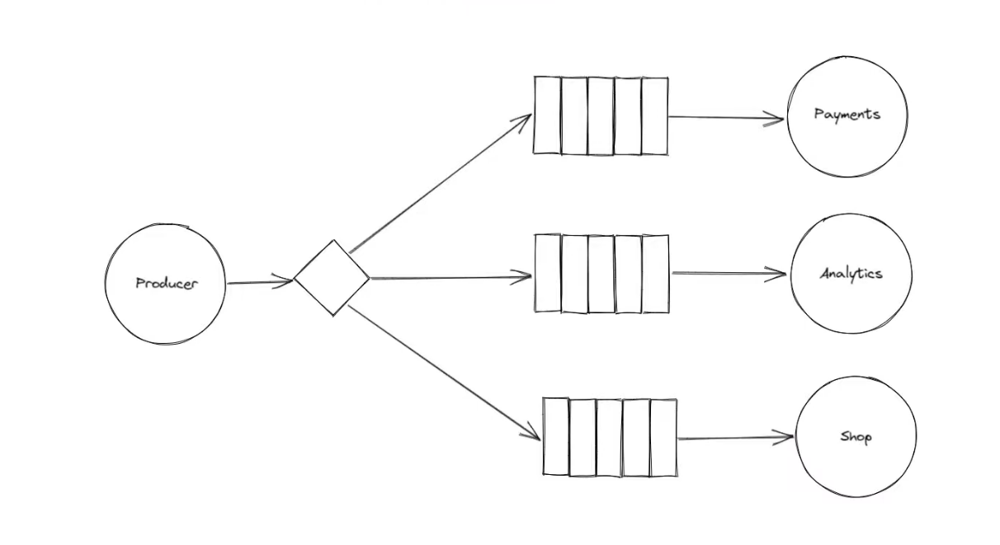

## Fan-Out Example (Pub/Sub)

How It Works:

	1.	The producer publishes messages to a fanout exchange (instead of a queue).
	2.	Multiple consumers are connected to the exchange and receive copies of each message.
	3.	Each consumer processes the message independently.

