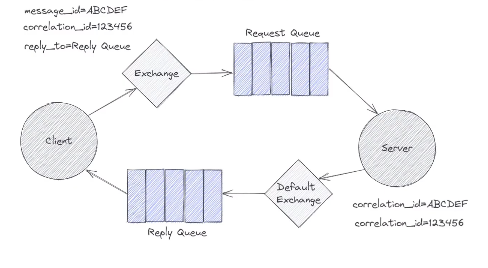

## Request - Reply Example

📌 Request-Response Pattern with RabbitMQ

In a Request-Response messaging pattern, a client sends a request to a server via RabbitMQ, and the server processes the request and sends a response back. This is implemented using Correlation IDs to match responses to requests.


📌 Architecture

	1. Client (Requester)
	    • Sends a request message to a queue (rpc_queue).
	    • Listens for a response on a dynamically created reply queue.
	    • Uses a correlation ID to match responses.

	2. Server (Responder)
	    • Listens on rpc_queue for incoming requests.
	    • Processes the request (e.g., simulates a computation).
	    • Sends the response back to the reply_to queue specified by the client.





🎯 Expected Output

The client sends a new request every 3 seconds, and the server responds accordingly:

Client Output:

```
 [x] Sending request: Request 1
 [.] Got response: Processed: Request 1
 [x] Sending request: Request 2
 [.] Got response: Processed: Request 2
 [x] Sending request: Request 3
 [.] Got response: Processed: Request 3
 ...
 ```