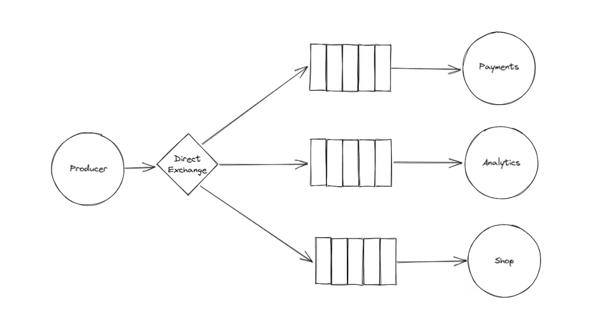
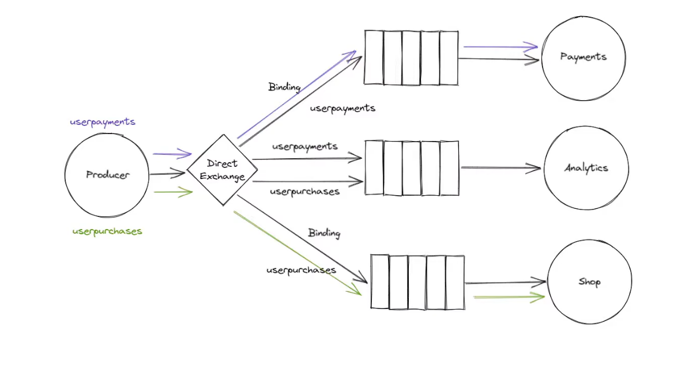

## Routing with a Direct Exchange

🎯 Expected Behavior:

	• Payments Consumer receives messages with routing key payments.
	• Analytics Consumer receives messages with routing key analytics.
	• Shop Consumer receives messages with routing key shop.

This Direct Exchange example ensures that messages are delivered only to the consumers matching the exact routing key. 🚀🐇

