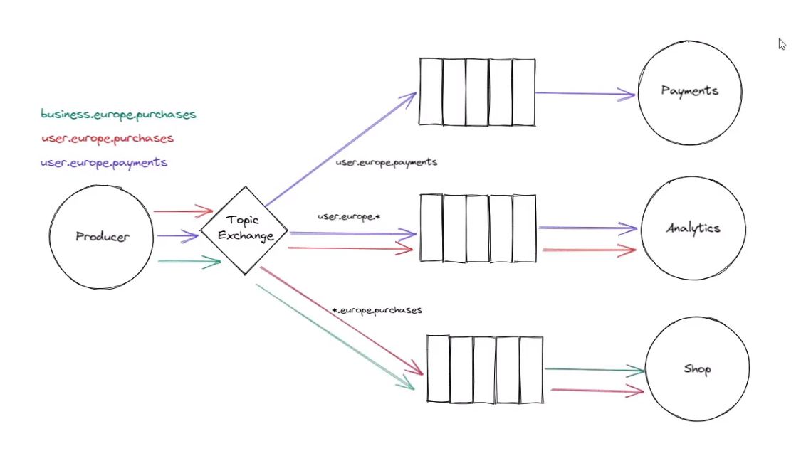

## Routing Topic Exchange Example

🎯 Expected Behavior:

	• Payments Consumer receives user.europe.payments only.
	• Analytics Consumer receives all user.europe.* messages.
	• Shop Consumer receives *.europe.purchases.

This fully implements the Topic Exchange pattern! 🚀🐇

